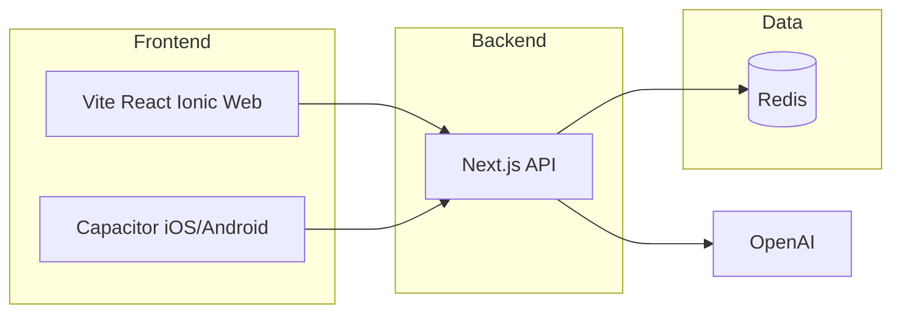

# Money Tracker App – Implementation Plan

## Architecture

- **Monorepo**: `frontend/` (Vite + React + Ionic + Capacitor), `backend/` (Next.js API), root `capacitor.config.ts` with `webDir: "frontend/dist"`.
- **Frontend**: Single Vite + React app with Ionic React; TypeScript, standard Vite build → `dist/`. Capacitor uses `frontend/dist` (no conditional export flags). API base URL via `VITE_API_URL` (e.g. `import.meta.env.VITE_API_URL`) for both web and Capacitor (absolute URLs for native).
- **Backend**: Standalone Next.js app (API routes only, no UI), port e.g. 3000; frontend dev on 3001.
- **Data**: Redis via external provider (e.g. Upstash). Store: user accounts, parsed transactions, detected recurring expenses, user settings (balance, paycheck amount, next bonus date), and session/token data for auth.
- **Auth**: Email/password; backend issues HTTP-only cookies or JWT; frontend sends credentials/cookie on API requests.
- **AI**: OpenAI in backend for (1) recurring-expense extraction from uploaded transactions (after CSV upload) and (2) chat completions; chat endpoint uses recurring expenses + health metric + user message to update/explain health.

---

## 1. Project scaffolding (Vite + React + Ionic layout)

- **Root**: Create `frontend/` and `backend/`; root `package.json` with workspaces or separate `package.json` per app; root `capacitor.config.ts` with `appId`, `appName`, `webDir: "frontend/dist"`.
- **Frontend** (`frontend/`):
  - Vite + React + TypeScript: `npm create vite@latest frontend -- --template react-ts` (or equivalent).
  - Install: `@capacitor/core`, `@capacitor/cli`, `@capacitor/android`, `@capacitor/ios`, `@ionic/react`, `ionicons`; optional `@capacitor/splash-screen`, `@capacitor/status-bar`, `@capacitor/app`.
  - Use official Ionic Vite setup: `vite.config.ts` per Ionic docs. Vite build outputs to `dist/` by default.
  - Entry: `index.html` → `src/main.tsx`. In the root component (e.g. `App.tsx`), call `setupIonicReact()` once; import Ionic core CSS and dark palette (e.g. `@ionic/react/css/core.css`, `@ionic/react/css/palettes/dark.css`); set viewport and theme-color in `index.html` or via a component. Wrap the app in `IonApp`.
  - Scripts: `dev` (e.g. port 3001), `build` (Vite → `dist/`), `cap:sync` = `npm run build && npx cap sync`.
- **Backend** (`backend/`):
  - New Next.js app with App Router; only API routes under `app/api/`. No UI pages. Port 3000 in dev.
  - Env: `REDIS_URL`, `OPENAI_API_KEY`, `JWT_SECRET` (or session secret), `NEXTAUTH_URL` or CORS origin for frontend.

See Ionic and Capacitor official documentation for Vite setup details.

---

## 2. Chase CSV parsing and recurring-expense detection (backend)

- **CSV format** (from `docs/chase.csv`): Columns `Details`, `Posting Date`, `Description`, `Amount`, `Type`, `Balance`, `Check or Slip #`. Dates `MM/DD/YYYY`. Amount: negative = debit, positive = credit.
- **Upload API**: e.g. `POST /api/transactions/upload` — accept multipart CSV file; parse (handle quoted fields); validate headers; store raw rows in Redis keyed by `userId` (and optionally `accountId`) with a cutoff so only last N months or last upload wins, per your product choice.
- **Recurring detection** (AI + fallback, module + API):
  - **Primary: AI extraction**. After upload, send a condensed representation of stored transactions (grouped by merchant, debits only) to OpenAI chat completions. The model identifies recurring expenses and returns a structured list of `{ name, amount, frequency, typicalDayOfMonth? }`. Implement in `backend/lib/extractRecurringWithAI.ts`; call after upload or when recomputing recurring list.
  - **Fallback: rule-based**. When `OPENAI_API_KEY` is not set or the AI call fails, use the existing backend service `backend/lib/recurring.ts`: normalize description, group debits by merchant, infer interval via date deltas, compute typical amount, mark as recurring if interval is regular enough.
  - **Payroll vs bonus**: Separate credits that look like payroll (e.g. "MEDIA NEWS GROUP PAYROLL" or "DIRECT DEP") — treat large outliers (e.g. >> 2× median payroll) as bonus; optionally tag by user-configurable "payroll" vs "bonus" labels. (Unchanged; see `backend/lib/payroll.ts`.)
  - **Output**: List of `{ name, amount, frequency, typicalDayOfMonth? }` and optionally list of payroll/bonus events with dates and amounts.
  - Expose: `GET /api/transactions/recurring` (and optionally `GET /api/transactions/payroll`) using data stored for the authenticated user.

Implementation note: Recurring expenses are extracted via AI (OpenAI) from the stored transactions after upload; use rule-based detection in `backend/lib/recurring.ts` as fallback when AI is unavailable or errors. Call extraction after upload or on-demand when the user requests or when recurring list is missing.

---

## 3. Financial health metric (backend)

- **Inputs** (from Redis / user settings): current Chase balance (user-supplied), paycheck amount (editable), next bonus date (user-supplied), and optional bonus amount if known.
  - **Inflows**: Bi-weekly paychecks from "today" until "next bonus date"; one bonus on that date.
  - **Outflows**: From recurring expenses, project debits in the same window (by frequency and typical day/amount); optionally exclude one-off categories if you mark them.
- **Computation**: For each day in [today, next_bonus_date]: add paycheck on payday, add bonus on bonus date; subtract projected recurring expenses by day. Starting balance + sum(inflows) - sum(outflows) → projected balance at bonus date.
  - **Health states**: e.g. "not_enough" (projected balance < 0 or below a safety threshold), "enough" (above threshold), "too_much" (e.g. above a higher threshold). Thresholds can be configurable (e.g. 0 and 500).
- **API**: `GET /api/health` returns `{ status: "not_enough" | "enough" | "too_much", projectedBalance, breakdown? }`. Optionally `PATCH /api/settings` to update balance, paycheck amount, next bonus date (and bonus amount).

---

## 4. AI chat completion (backend)

- **Endpoint**: e.g. `POST /api/chat` — body: `{ message: string }`. Auth required.
- **Context**: Load from Redis for the user: recurring expenses list, health metric result, user settings (balance, paycheck, next bonus date). Optionally last N messages for conversation continuity.
- **Prompt**: System prompt describing the app (recurring account, bi-weekly pay, quarterly bonus, health metric). Include structured context (recurring list, health status, projected balance). User message can ask to "update" or "explain" health (e.g. "Why is it not enough?" or "What if I reduce Disney Plus?").
- **Provider**: Use OpenAI chat completions (e.g. `openai.chat.completions.create()`). Return assistant reply; optionally store last exchange in Redis for multi-turn.
- **Frontend**: Chat UI (e.g. on a dedicated tab or screen) sends `message` to `POST /api/chat` and displays streamed or full response.

---

## 5. Authentication (backend + frontend)

- **Backend**: Email/password only. Options: (a) NextAuth.js with Credentials provider and Redis adapter for sessions, or (b) custom: register (hash password with bcrypt), login (verify + issue JWT or session id stored in Redis). Use HTTP-only cookie for session/JWT if web.
  - Routes: `POST /api/auth/register`, `POST /api/auth/login`, `POST /api/auth/logout`, optional `GET /api/auth/session`.
  - Store users in Redis (key by email or user id); store session/token by session id.
- **Frontend**: Login/register forms (email + password). On success, store session (cookie or token); send cookie or `Authorization` header on all API requests. Protect routes: redirect unauthenticated users to login.

---

## 6. Redis schema (external provider)

- **Keys** (examples; use a prefix like `mt:`):
  - `mt:user:{email}` or `mt:user:id:{id}` — user record (id, email, password hash, createdAt).
  - `mt:session:{sessionId}` — session data (userId, expiry).
  - `mt:settings:{userId}` — balance, paycheck amount, next bonus date, bonus amount.
  - `mt:txns:{userId}` — uploaded transaction rows (e.g. JSON array or list of hashes).
  - `mt:recurring:{userId}` — cached result of recurring detection (list of recurring expenses + payroll/bonus).
  - `mt:chat:{userId}` — optional last N messages for context.
- Use Upstash Redis (or another provider) and `@upstash/redis` or `ioredis` in the backend.

---

## 7. Frontend UI (minimalist dark, fonts, Ionic tabs)

- **Theme**: Dark theme only. Simple shapes, borders (e.g. cards with 1px border, no heavy shadows). Use Ionic dark palette; override in `App.css` or `globals.css` so background and borders match "minimalist dark."
- **Fonts**:
  - Headings: **Press Start 2P** (Google Fonts).
  - Body: **VT323** (Google Fonts).
  - Load in `index.html` (font links) and main app CSS (e.g. `App.css` or `globals.css`); apply via Tailwind or CSS classes (e.g. `font-heading`, `font-body`).
- **Navigation**: Ionic **IonTabs** at the bottom (footer). Tabs suggested: Home (dashboard / health), Expenses (recurring list), Upload (CSV upload), Chat (AI), Settings (balance, paycheck, next bonus date). Use `ion-tab-bar` with `slot="bottom"` and `ion-tab-button` with icons (e.g. home, list, cloud-upload, chatbubble, settings).
- **Screens**: Use React Router (or similar) for tabs and auth. Implement pages under `src/pages/` (or `src/routes/`): Home, Expenses, Upload, Chat, Settings, Login, Register. `App.tsx` holds the shell (tabs and route definitions).
  - **Home**: Show financial health status (enough / not enough / too much), projected balance, and maybe a short summary (e.g. next paycheck date, days until bonus).
  - **Expenses**: List of detected recurring expenses (name, amount, frequency); allow optional "ignore" or "edit" later if you add that.
  - **Upload**: File input for Chase CSV; "Upload" button; call `POST /api/transactions/upload`; on success, trigger recurring detection and refresh health.
  - **Chat**: Input + send; display AI replies (context = health + recurring + settings).
  - **Settings**: Form fields: current balance, paycheck amount, next bonus date (and optional bonus amount). Save via `PATCH /api/settings`.
- **Auth**: Login and Register pages (simple forms); after login, redirect to Home or default tab.

---

## 8. Key files to add (summary)

| Area | Location | Purpose |
|------|----------|---------|
| Scaffolding | Root + `frontend/`, `backend/` | Vite + React + Ionic app, Next.js backend, Capacitor config (see Ionic/Capacitor Vite docs) |
| CSV + recurring | `backend/lib/csv.ts`, `backend/lib/extractRecurringWithAI.ts`, `backend/lib/recurring.ts` | Parse Chase CSV; AI extract recurring (with rule-based fallback); payroll vs bonus |
| Health | `backend/lib/health.ts` | Project inflows/outflows; compute status (not_enough / enough / too_much) |
| API | `backend/app/api/transactions/upload`, `recurring`, `backend/app/api/health`, `settings`, `backend/app/api/chat`, `backend/app/api/auth/*` | Upload, recurring, health, settings, chat, auth |
| Redis | `backend/lib/redis.ts` | Client and key helpers |
| Auth | `backend/lib/auth.ts` + auth API routes | Register, login, session, middleware to protect API routes |
| UI | `frontend/index.html`, `frontend/src/main.tsx`, `frontend/src/App.tsx`, `frontend/vite.config.ts`, `frontend/src/pages/` | Entry, app shell, tabs (home, expenses, upload, chat, settings), auth pages (login, register) |
| Fonts + theme | `frontend/src/App.css` or `globals.css`, `frontend/src/App.tsx`, `index.html` | Press Start 2P, VT323, dark theme variables |

---

## 9. Environment and run order

- **Backend**: `REDIS_URL`, `OPENAI_API_KEY`, `JWT_SECRET` (or NextAuth secret), CORS origin for `http://localhost:3001` and your production frontend URL.
- **Frontend**: `VITE_API_URL` (e.g. `http://localhost:3000` in dev, backend URL in prod). Access in code via `import.meta.env.VITE_API_URL`.
- **Run**: Start backend (`cd backend && npm run dev`), then frontend (`cd frontend && npm run dev`). For mobile: `cd frontend && npm run build && npx cap sync`, then open iOS/Android project.

---

## 10. Optional follow-ups (out of scope for initial plan)

- Push notifications (Capacitor and Ionic docs cover setup).
- Editing recurring items (e.g. mark as one-off, or override amount).
- Multiple accounts or multiple CSV files (current plan: one account, one active upload per user).
- Onboarding: first-time flow to upload CSV and set balance, paycheck, bonus date in one step.

This plan assumes one Chase account per user, one "active" transaction set (last upload overwrites or appends per your choice), and financial health computed from user-supplied balance plus editable paycheck and next bonus date.
